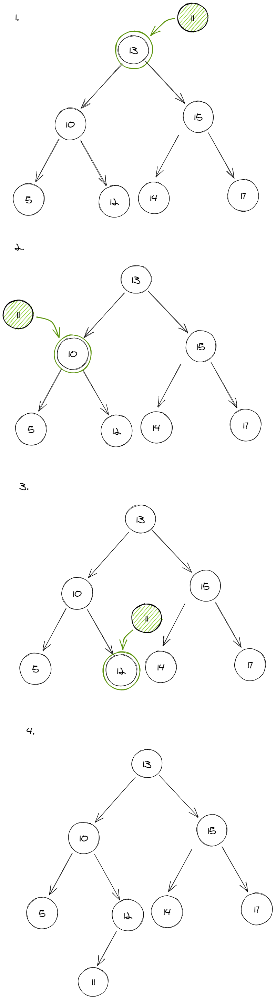
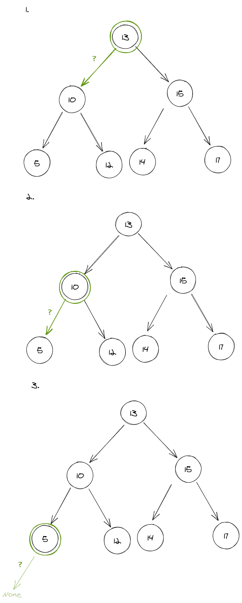
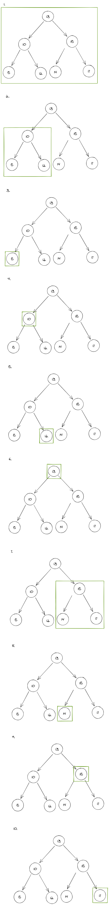

1. Draw/model out inserting a new element into a binary search tree.

2. Draw/model out how to traverse a binary search tree and get to the minimum element in the tree.

3. Draw/model out how to traverse the tree in order from the smallest element in the tree to the largest element in the tree.

