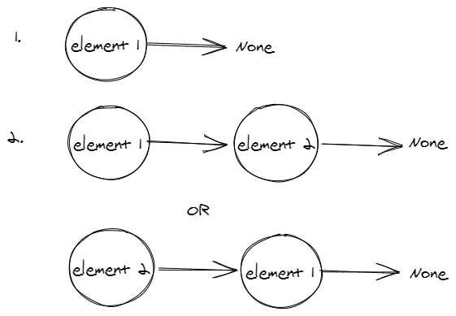
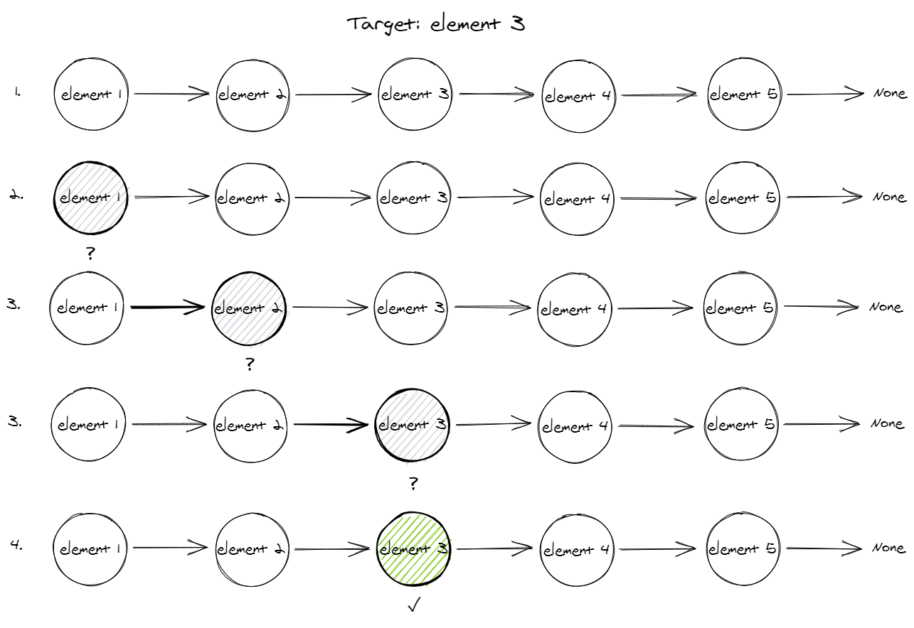
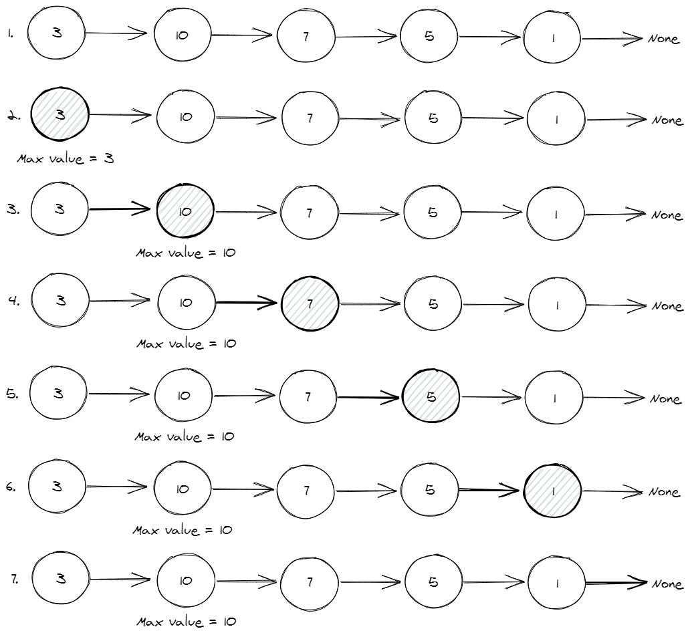

1. Draw/model out inserting a new element into a linked list with only one element.

2. Draw/model out how to traverse through a linked list in order to find a target value.

3. Draw/model out how to traverse through a linked list in order to find the maximum value in the linked list.

