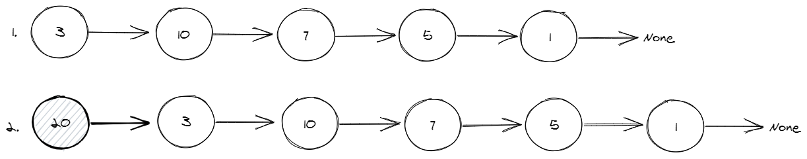
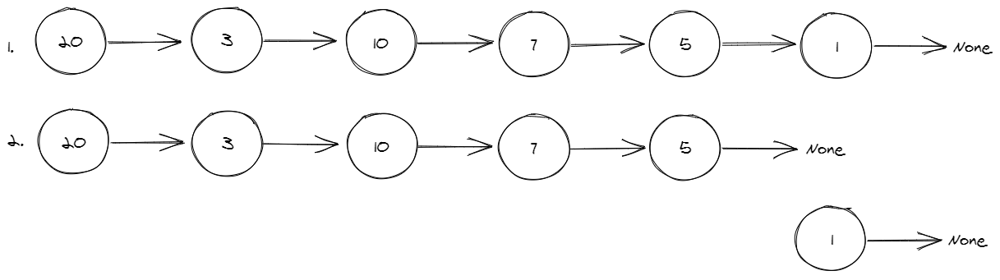

1. Draw/model out enqueuing into a queue that uses a linked list as its underlying storage structure.

2. Draw/model out dequeuing from a queue that uses a linked list as its underlying storage structure.

